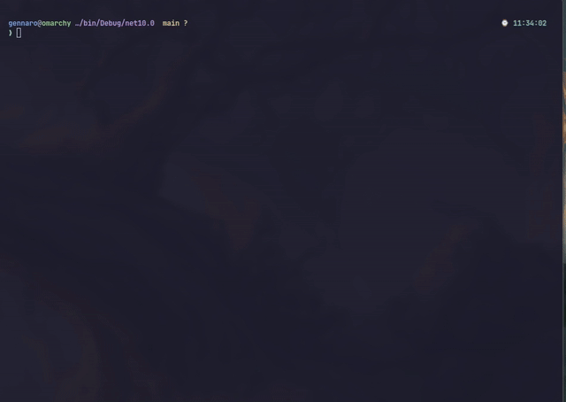

# ⬡ NetScaffold TUI

A terminal-based user interface for scaffolding production-ready .NET solutions with Clean Architecture patterns.

## ⬡ Overview

NetScaffold TUI helps .NET developers quickly generate standardized solutions with:

* ⬡ Clean Architecture layers (Domain, Application, Infrastructure, API/Worker/Console)
* ⚙️ Configurable features (Swagger, Serilog, MediatR, Health Checks, etc.)
* 🐳 CI-ready output (Dockerfile, GitHub Actions, .gitignore)
* 📝 Automatic C# naming conventions

## ⬡ Demo



## ⬡ Requirements

* ⬡ .NET 10.0 SDK
* ⬡ Terminal.Gui v1.19.0

## ⬡ Quick Start

```bash
git clone https://github.com/GennaroRiccio/netscaffold-tui.git
cd netscaffold-tui
dotnet run --project src/NetScaffoldTui
```

## ⬡ Build

### Development

```bash
dotnet build              # build from repo root
dotnet run --project src/NetScaffoldTui   # run the TUI wizard
```

### Cross-Platform Publish

The build script produces self-contained single-file executables for Windows, Linux and macOS. Requires PowerShell 7+ (`pwsh`).

```powershell
./build.ps1                          # all targets: win-x64, linux-x64, osx-x64, osx-arm64
./build.ps1 -Runtime linux-x64       # single target
./build.ps1 -Configuration Debug     # all targets in Debug
```

Output goes to `publish/<runtime>/`.

| Runtime    | Output                        |
|------------|-------------------------------|
| win-x64    | `publish/win-x64/NetScaffoldTui.exe` |
| linux-x64  | `publish/linux-x64/NetScaffoldTui`   |
| osx-x64    | `publish/osx-x64/NetScaffoldTui`     |
| osx-arm64  | `publish/osx-arm64/NetScaffoldTui`   |

## ⬡ Usage

1. **▸ Select Project Type**: Console, Web API, or Worker Service
2. **⚙️ Configure Solution**: Set name and output path
3. **☑ Enable Features**: Toggle Swagger, Serilog, MediatR, Health Checks, FluentValidation, EF Core, Mapster
4. **📦 Add Packages**: Select from curated list of NuGet packages
5. **▶ Generate**: Creates complete solution structure

### Available NuGet Packages

AutoMapper, Polly, YamlDotNet, Dapper, NHibernate, MassTransit, Quartz, Hangfire, Redis, MongoDB.Driver, Azure.Storage.Blobs, AWS.SDK.S3, SendGrid, MailKit, GraphQL, Newtonsoft.Json

## ⬡ Generated Output

```
SolutionName/
├── src/
│   ├── SolutionName.Domain/           # Entities, ValueObjects, Interfaces
│   ├── SolutionName.Application/      # UseCases, DTOs, Services
│   ├── SolutionName.Infrastructure/   # Data, Services
│   └── SolutionName.Api/              # Controllers, Endpoints, Middleware (or .Worker / .Console)
├── tests/
│   ├── SolutionName.Domain.Tests/
│   └── SolutionName.Application.Tests/
├── Directory.Build.props
├── Dockerfile
├── .github/workflows/dotnet.yml
├── .gitignore
└── SolutionName.sln
```

## ⬡ Features

| Feature | Default | Description |
|---------|---------|-------------|
| ⬡ Swagger | Enabled | OpenAPI documentation |
| 📝 Serilog | Enabled | Structured logging (console + file sinks) |
| 🧩 MediatR | Disabled | CQRS / Mediator pattern |
| ❤️ Health Checks | Enabled | Liveness endpoints |
| ✓ FluentValidation | Enabled | Request validation |
| 🔗 Entity Framework Core | Enabled | ORM support |
| 🔄 Mapster | Enabled | Object mapping |

## ⬡ CI/CD

Generated solutions include:

* 🐳 `Dockerfile` — Multi-stage build (SDK 9.0, runtime/aspnet base image per project type)
* ⚡ `.github/workflows/dotnet.yml` — GitHub Actions (restore, build, test)
* 📝 `.gitignore` — .NET defaults
* 📋 `Directory.Build.props` — Centralized package version management

## ⬡ Author

* `Gennaro Riccio`

## ⬡ License

MIT
